<!-- _class: title -->
# Measuring Linguistic Distance Using Spectral Overlap
## Thom Lazor
## Advisor: Jan Šnajder
## University of Zagreb – FER
## July 2025
---

<!-- header: 'Table of contents' -->
**Motivation**
Related Work
Research questions & contributions 
Background  
Methodology  
Experiments  
Results  
Limitations  
Future work

---
<!-- header: 'Motivation' -->
Quantifying how *dissimilar* two languages are helps to  
* allocate teaching hours efficiently  
* guide model-transfer paths in low-resource NLP  
* reconstruct family trees in historical linguistics  
* prioritise endangered-language support

---
<!-- header: 'Gap in Existing Metrics' -->

* Producing distance matrices is **slow, uneven, or narrow in scope**.  
* Only *some* typological axes get measured, *some* languages get compared.  
* Often requires **costly, labour-intensive fieldwork**.

---
<!-- header: 'Opportunity: Language Models and Frequency Analysis' -->

* **Language models**  
  * Multilingual transformers internalise phonology, morphology, syntax, semantics.  
  * Every token yields **high-dimensional embedding / likelihood**

* **Text signals** : A sequence of embeddings or log-probs can be treated as a *time-series*

* **Frequency analysis looks past words**  
  * The Fourier transform highlights **periodicities** 
  * It ignores surface token identity and instead inspects **how** information is rhythmically distributed.

---
<!-- header: 'Table of contents' -->
Motivation
**Related Work**
Research questions & contributions  
Background  
Methodology  
Experiments  
Results  
Limitations  
Future work

---
<!-- header: 'Related Work – Linguistic Distance Metrics' -->

<table class="periodicities">
  <thead>
    <tr>
      <th>Approach</th>
      <th>Signal</th>
      <th>Strengths</th>
      <th>Blind spots</th>
    </tr>
  </thead>
  <tbody>
    <tr>
      <td><strong>Cognate / string</strong> (Swadesh LD, ASJP)</td>
      <td>Word lists</td>
      <td>Simple, interpretable</td>
      <td>Ignores syntax &amp; discourse</td>
    </tr>
    <tr>
      <td><strong><em>n</em>-gram divergences</strong> (KL on trigram LMs)</td>
      <td>Probability dists.</td>
      <td>Captures ordering</td>
      <td>Data sparseness, tokenization bias</td>
    </tr>
    <tr>
      <td><strong>Embedding geometry</strong> (multilingual skip-gram, mBERT vecs)</td>
      <td>Vector space</td>
      <td>Dense, model-led</td>
      <td>Model-specific; opaque</td>
    </tr>
    <tr>
      <td><strong>Typological overlap</strong> (WALS, URIEL)</td>
      <td>Expert features</td>
      <td>Human-readable</td>
      <td>Sparse, coarse, costly</td>
    </tr>
  </tbody>
</table>

*Most compute **time-domain** distances; periodic structure remains untapped.*

---
<!-- header: 'Related Work – Signal-Processing in NLP' -->
**Text as a signal**
* Spectral peaks in letter / word streams → authorship, topic keywords.
* DFT reveals **long-range correlations** and stylistic rhythms.

**Neural frequency signatures**
* Embedding eigen-spectra expose anisotropy.  
* Attention heads approximate Kalman filters.  

---
<!-- header: 'Table of contents' -->
Motivation
Related Work
**Research questions & contributions**  
Background  
Methodology  
Experiments  
Results  
Limitations  
Future work

---
<!-- header: 'Research Questions' -->
1. **RQ1** – Do spectral metrics correlate with phonemic, lexical, cognitive & pedagogical baselines?  
2. **RQ2** – Are the metrics model- and dataset-agnostic?  
3. **RQ3** – Which frequency bands drive the correlation, and do they reflect typological traits?

---
<!-- header: 'Main Contributions' -->
* Introduce **Spectral KL** & **Spectral Coherence** distances  
* Evaluate 100 languages, 2 transformers, 2 corpora, 3 metrics  
* Map discriminative frequency bands to linguistic features

---

<!-- header: 'Table of contents' -->
Motivation
Related Work
Research questions & contributions  
**Background**  
Methodology  
Experiments  
Results  
Limitations  
Future work

---

<!-- header: 'Background: Linguistic Subsystems' -->
| Subsystem | Captures | Typical distance |
|-----------|----------|------------------|
| Phonetics | Raw sounds | IPA edit distance |
| Phonology | Sound system rules | Jaccard inventories |
| Morphology | Word structure | Morphemes/word |
| Syntax | Phrase order | Tree-edit |
| Semantics | Meaning | Embedding cosine |

---
<!-- header: 'Baselines' -->
* **Phonemic** – ASJP LDND 
* **Lexical** – Swadesh Levenshtein  
* **Mutual intelligibility** – cloze tests  
* **FSI learning time** – weeks for English L1 diplomats

---
<!-- header: 'Language Modelling in a Nutshell' -->
*Goal:* assign a probability to a token sequence  
$
   P(w_{1:n})=\prod_{t=1}^{n}P(w_t\mid w_{1:t-1})
$

<table class="periodicities">
  <thead>
    <tr>
      <th>Model</th>
      <th>Context window</th>
      <th>Drawbacks</th>
    </tr>
  </thead>
  <tbody>
    <tr>
      <td><em>n</em>-gram, Katz/Kneser smoothing</td>
      <td>fixed (n−1) tokens</td>
      <td>sparsity, short range</td>
    </tr>
    <tr>
      <td>Continuous <em>n</em>-gram (word2vec)</td>
      <td>fixed</td>
      <td>still local</td>
    </tr>
    <tr>
      <td>RNN / LSTM / GRU</td>
      <td><em>unbounded</em> (sequential)</td>
      <td>slow, vanishing grads</td>
    </tr>
    <tr>
      <td><strong>Transformers</strong></td>
      <td>full sentence (parallel)</td>
      <td>&mdash;</td>
    </tr>
  </tbody>
</table>

---
<!-- header: 'Neural Language Models' -->
**Recurrent** (LSTM/GRU)  
$
   \mathbf{h}_t = f(\mathbf{h}_{t-1}, \mathbf{e}(w_t))
$
unbounded history, but sequential updates.

**Attention** replaces recurrence  
$
   \text{Attn}(Q,K,V)=\operatorname{softmax}\!\bigl(QK^{\!\top}/\sqrt{d_k}\bigr)V
$

**Transformer layer** = Multi-Head Attention + Feed-Forward + Residual & LayerNorm.  
Stacking layers yields deeply contextual embeddings

---
<!-- header: 'mBERT/XLM-R' -->
*Pre-trained language encoders that share parameters across dozens of languages.*
 
- **Training objective** – masked-language modelling (MLM) on mixed-language corpora
- **Sub-word vocabulary** – WordPiece (mBERT 110 k) or SentencePiece-BPE (XLM-R 250 k) built jointly across languages → **shared embedding space**.  
- **Emergent alignment**  
  - Cross-lingual tokens with similar context land near one another.  
  - Mid-layers capture phonology & morphology; upper layers encode syntax & semantics.

---
<!-- header: 'Fourier Transform' -->
*Transforms a time-domain signal into its frequency components.*

$
  X(f)=\mathcal{F}\{x(t)\}
      =\int_{-\infty}^{\infty} x(t)\,e^{-j2\pi f t}\,dt
$

* **Discrete variant**:
  $
    X[k]=\sum_{n=0}^{N-1} x[n]\,
         e^{-j\,2\pi k n / N},
    \qquad k=0,\dots,N-1
  $

* **Energy <> variance**:  
  $\sum_{n}|x[n]|^{2}=\tfrac{1}{N}\sum_{k}|X[k]|^{2}$

---
<!-- header: 'Welchs Method' -->
*Variance-reduced estimate of the power spectral density (PSD).*

1. **Segment** the signal into \(K\) overlapping frames of length \(L\)  
   (e.g. 50 % overlap, Hann window (w[n])).
2. **Window** each frame: $x_i^{w}[n]=x_i[n]\;w[n]$.
3. **Periodogram per frame**  

   $
     P_i(f)=\frac{1}{U}\,
            \bigl|\mathcal{F}\{x_i^{w}\}(f)\bigr|^{2},
     \quad
     U=\tfrac{1}{L}\sum_{n}w^{2}[n]
   $

4. **Average** the periodograms  

   $
     \hat{P}_{\text{Welch}}(f)=
     \frac{1}{K}\sum_{i=1}^{K} P_i(f)
   $ 

---
<!-- header: 'Why Spectra?' -->
* Language encodes **periodicities** (stress, affixes, phrase lengths)  
* Comparing PSDs asks *“How is information rhythmically distributed?”*  
* Captures structure missed by token-level overlap

---
<!-- header: 'Periodicities in Text' -->

<table class="periodicities">
  <thead>
    <tr>
      <th><strong>Device</strong></th>
      <th><strong>Scale</strong></th>
      <th><strong>Periodicity pattern</strong></th>
      <th><strong>Example</strong></th>
    </tr>
  </thead>
  <tbody>
    <tr>
      <td>Ablaut reduplication</td>
      <td>Token</td>
      <td>Fixed vowel alternation (e.g., <em>i–a–o</em>) inside paired morphemes</td>
      <td><em>ping-pong</em>, <em>tic-tac-toe</em></td>
    </tr>
    <tr>
      <td>Anadiplosis</td>
      <td>Word</td>
      <td>End-of-clause word becomes start of next clause</td>
      <td>Fear leads to <em>anger</em>; <em>anger</em> leads to <em>hate</em>; <em>hate</em> leads to suffering.</td>
    </tr>
    <tr>
      <td>Epistrophe</td>
      <td>Phrase</td>
      <td>Identical phrase closes successive units</td>
      <td>…of the <em>people</em>, by the <em>people</em>, for the <em>people</em>.</td>
    </tr>
    <tr>
      <td>Antithetical parallel</td>
      <td>Sentence</td>
      <td>Mirrored clauses with inverse relation</td>
      <td>Ask not what your country can do for you; ask what you can do for your country.</td>
    </tr>
  </tbody>
</table>

---
<!-- header: 'Coherence' -->

Coherence measures the degree to which one signal $x(t)$ predicts another $y(t)$ via an optimal least-squares estimator.

$
C_{xy}(f)=\frac{\lvert G_{xy}(f)\rvert^{2}}{G_{xx}(f)\,G_{yy}(f)}
$

$
G_{xy}(f) = \mathcal{F}\!\bigl\{R_{xy}(\tau)\bigr\}
          = \int_{-\infty}^{\infty} R_{xy}(\tau)\,e^{-j2\pi f\tau}\,d\tau
          = \mathbb{E}\!\bigl\{X(f)\,Y^{*}(f)\bigr\}
$

$R_{xy}(\tau)=\mathbb{E}\!\{x(t)\,y^{*}(t+\tau)\}$ is the cross-correlation function

---
<!-- header: 'Coherence' --> 

* **Geometric view:** $|\cos\theta|$ between time-series vectors 
* **Range:** $0 \le C_{xy}(f) \le 1$  
  * **0 → low coherence:** non-linear link, extra inputs, or high noise  
  * **1 → high coherence:** strong linear predictability  
* **Symmetric:** $|G_{xy}(f)| = |G_{yx}(f)|$
* **Practical use:** frequency-resolved health check  
  * High-$C_{xy}$ band ⇒ system behaving as modelled  
  * Low-$C_{xy}$ band ⇒ investigate fault (e.g., lubrication, impurities)

---
<!-- header: 'KL Divergence' -->

$
    D_{\mathrm{KL}}\!\bigl(P \,\Vert\, Q\bigr)
      \;=\;
      \sum_{i} P(i)\,\log\!\frac{P(i)}{Q(i)}
$

* **Interpretation:** the surprisal from using $Q$ as a model, when the true probability distribution is $P$

* **Non-negative:** $D_{\mathrm{KL}}\!\ge 0$  
* **Asymmetric:** $D_{\mathrm{KL}}(P \,\Vert\, Q)\neq D_{\mathrm{KL}}(Q \,\Vert\, P)$

---
<!-- header: 'Table of contents' -->
Motivation
Related Work
Research questions & contributions  
Background 
**Methodology**   
Experiments  
Results  
Limitations  
Future work

---
<!-- header: 'Proposed Metrics' -->
- **Spectral Overlap**  
    $$
        PSO(l_1,l_2)=∑_f min(P_1(f), P_2(f))
    $$
- **Spectral KL Divergence**
    $$
        D_{\mathrm{KL}}\!\bigl(l_1 \,\Vert\, l_2\bigr)
        \;=\;
        \sum_{f\in\mathcal{F}}
        P_{l_1}(f)\,
        \log\!\frac{P_{l_1}(f)}{P_{l_2}(f)}
    $$
- **Magnitude-Squared Coherence**  
    $$
        D_{\mathrm{C}}\!\bigl(l_1, l_2\bigr)=\frac{1}{K}\sum_{k=1}^{K}\frac{\lvert G_{l_1l_2}(f_k)\rvert^{2}}{G_{l_1l_1}(f_k)\,G_{l_2l_2}(f_k)}
    $$

---
<!-- header: 'Datasets' -->

<table class="periodicities">
  <thead>
    <tr>
      <th>Corpus</th>
      <th>Domain / unit</th>
      <th>Languages</th>
      <th>Sampled size</th>
      <th>Remarks</th>
    </tr>
  </thead>
  <tbody>
    <tr>
      <td><strong>XNLI</strong> (Conneau 2018)</td>
      <td>Multi-genre sentences</td>
      <td>15&nbsp;(14&nbsp;+&nbsp;EN)</td>
      <td>600 × sentences (≥ 20 tokens)</td>
      <td>Machine-translated; balanced modern prose</td>
    </tr>
    <tr>
      <td><strong>Bible-Corpus</strong> (Christodouloupoulos 2015)</td>
      <td>Verse-aligned scripture</td>
      <td>100</td>
      <td>600 × verses (≥ 20 tokens)</td>
      <td>39 langs &lt; 1 M speakers; broad family spread</td>
    </tr>
  </tbody>
</table>

---
<!-- header: 'Models' -->

| Model              | Parameters | Vocabulary size | Languages |
|--------------------|-----------:|----------------:|-----------|
| **mBERT**          | 110 M      | 110 k           | 104       |
| **XLM-R (base)**   | 270 M      | 250 k           | 100       |

---
<!-- header: 'Experimental Pipeline' -->

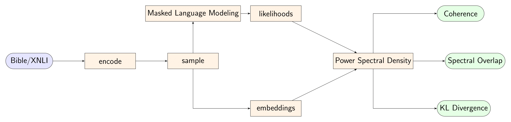

---
<!-- header: 'Table of contents' -->
Motivation
Related Work
Research questions & contributions  
Background 
Methodology   
**Experiments**  
Results  
Limitations  
Future work

---
<!-- header: 'Experiments' -->

  <!-- Experiments list -->
  

    <strong>E1</strong>  Time- vs. frequency-domain signals 
    <strong>E2</strong>  Model robustness (mBERT / XLM-R) 
    <strong>E3</strong>  Dataset robustness (Bible / XNLI) 
    <strong>E4</strong>  Layer-wise probe (12 layers) 
    <strong>E5</strong>  Sliding freq. windows (.04 & .10 BW) 
    <strong>E6</strong>  WALS feature probing
  

  <!-- RQs for reference -->
  

    <strong>RQ1</strong> – Do spectral metrics correlate with phonemic, lexical, cognitive & pedagogical baselines?   
    <strong>RQ2</strong> – Are the metrics model- and dataset-agnostic?   
    <strong>RQ3</strong> – Which frequency bands drive the correlation, and do they reflect typological traits?  
  

---
<!-- header: 'Table of contents' -->
Motivation
Related Work
Research questions & contributions  
Background 
Methodology   
Experiments  
**Results**  
Limitations  
Future work

---
<!-- header: 'Key Results' -->
| Baseline | Pearson r | Note |
|----------|-------:|-----------------|
| Phonemic | **0.62** |  -- |
| Lexical  | **0.67** |  -- |
| Intellig. | **–0.54** |  -- |
| FSI weeks | **0.52** | *Spearman |

---
<!-- header: E1: Time vs Frequency (Likelihood) -->

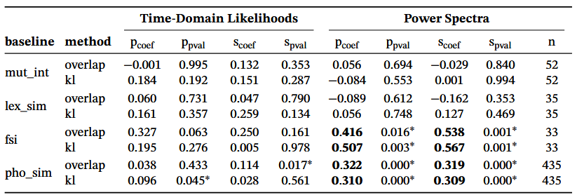

Likelihood correlations comparing distance metrics in the time domain and frequency domain. *p < 0.05. Bold indicates the larger (absolute) coefficient of the two significant values in each time-vs-frequency pair.

---
<!-- header: E1: Time vs Frequency (Embeddings) -->

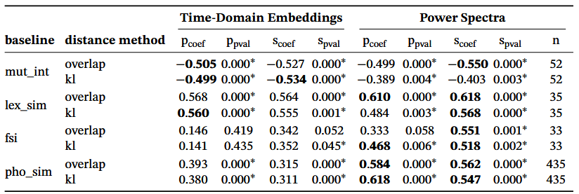

Embedding correlations comparing distance metrics in the time domain and frequency domain. *p < 0.05. Bold indicates the larger (absolute) coefficient of the two significant values in each time-vs-frequency pair.

---
<!-- header: E1: Coherence -->

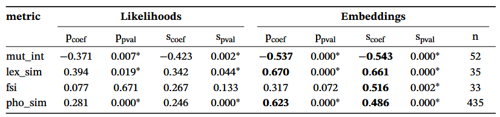

Spearman ($s_{coef}$) and Pearson ($p_{coef}$) correlations for likelihoods and embeddings with the coherence measure. 
*p < 0.05. Bold marks the larger (absolute) significant coefficient in each likelihood-vs-embedding pair.

---
<!-- header: E2: Metric Robustness to Models (Likelihood) -->

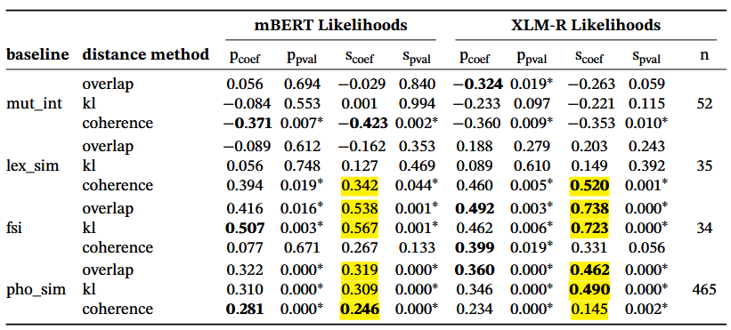

Likelihood spectral metric correlations with mBERT and XLM-R on the updated dataset. Highlighted cells mark coefficient pairs whose absolute difference exceeds 0.10; within those pairs, the larger significant coefficient is additionally shown in bold. *p < 0.05.

---
<!-- header: E2: Metric Robustness to Models (Embedding) -->

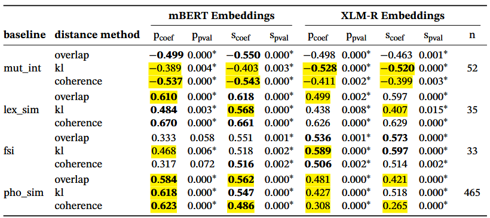

Embedding spectral metric correlations with mBERT and XLM-R. Highlighted cells show coefficient pairs that differ by more than 0.10; within each pair, the larger significant coefficient is additionally shown in bold. *p < 0.05.

---
<!-- header: E3: Metric Robustness to Dataset (Likelihood) -->

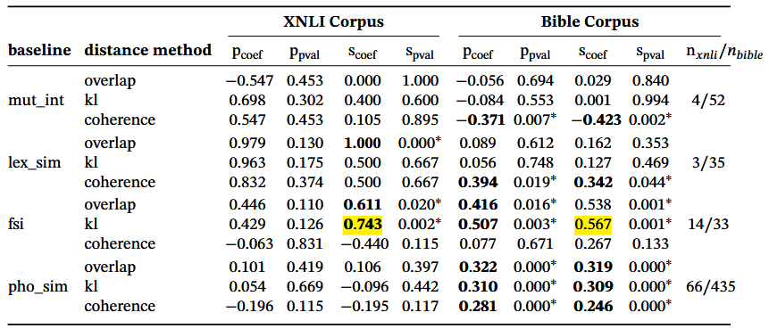

Likelihood spectral metric correlations on the XNLI and Bible corpora. Cells are highlighted when the two coefficients differ by more than 0.10; within those pairs, the larger significant coefficient is additionally shown in bold. *p < 0.05.

---
<!-- header: E3: Metric Robustness to Dataset (Embedding) -->

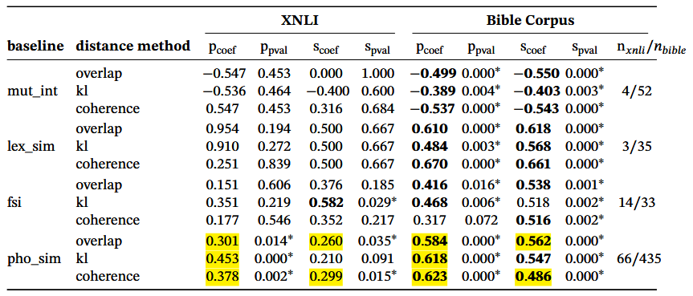

Embedding spectral metric correlations on the XNLI and Bible corpora. 
Cells are highlighted when the two coefficients differ by more than 0.10; within those pairs, the larger significant coefficient is additionally shown in bold. *p < 0.05.

---
<!-- header: E4: mBERT Layer Investigation (Spectral Overlap) -->

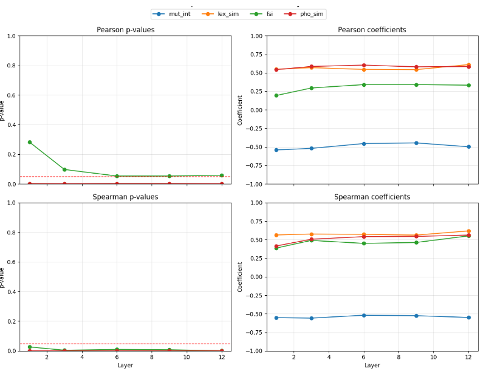

---
<!-- header: E4: mBERT Layer Investigation (Spectral KL) -->

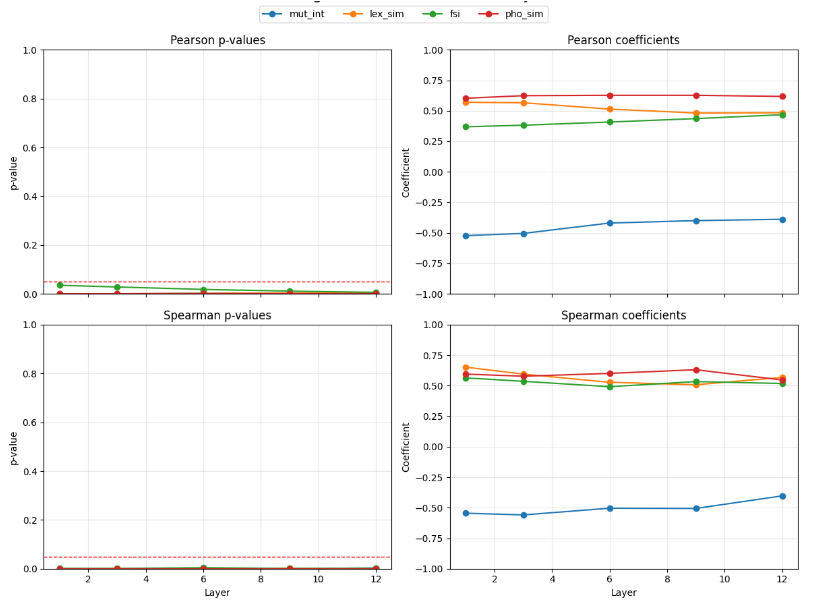

---
<!-- header: E5: Impact of Band Limiting (Overlap) -->

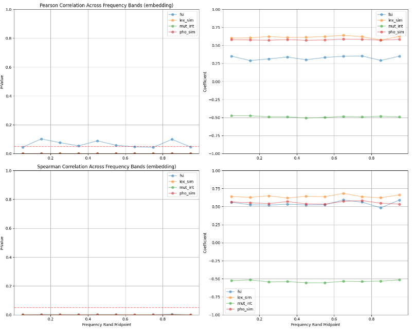

---
<!-- header: E5: Impact of Band Limiting (Overlap) -->

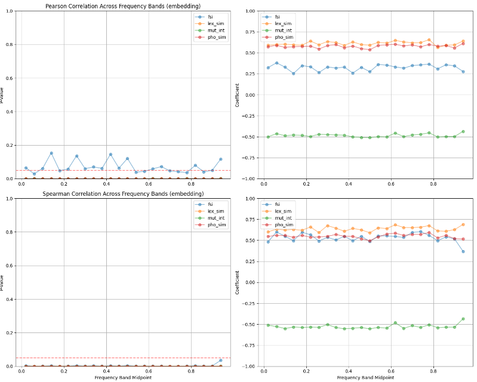

---
<!-- header: E6: Typological Modulation Effects (26A, Prefixing vs. Suffixing)-->

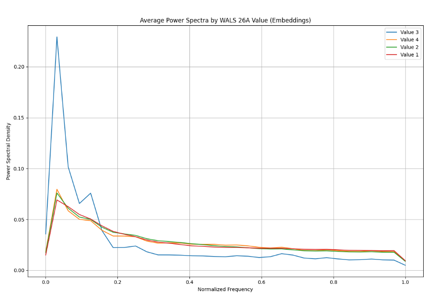

value 3: moderate preference for suffixing

---
<!-- header: E6: Typological Modulation Effects (51A, Case Affixes)-->

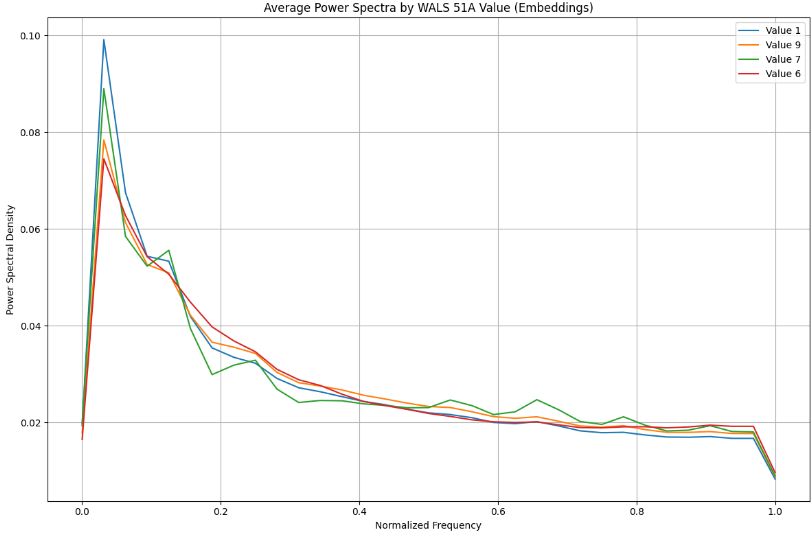

value 9: Neither case affixes nor adpositional clitics

---
<!-- header: Pointwise Pearson Contribution (Spectral KL, FSI) -->

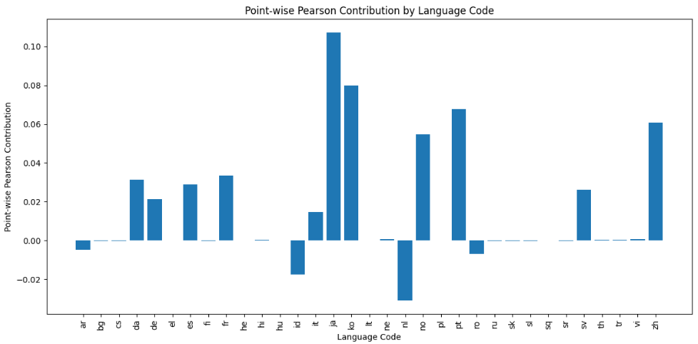

---
<!-- header: Pointwise Pearson Contribution (Spectral KL, Lexical) -->

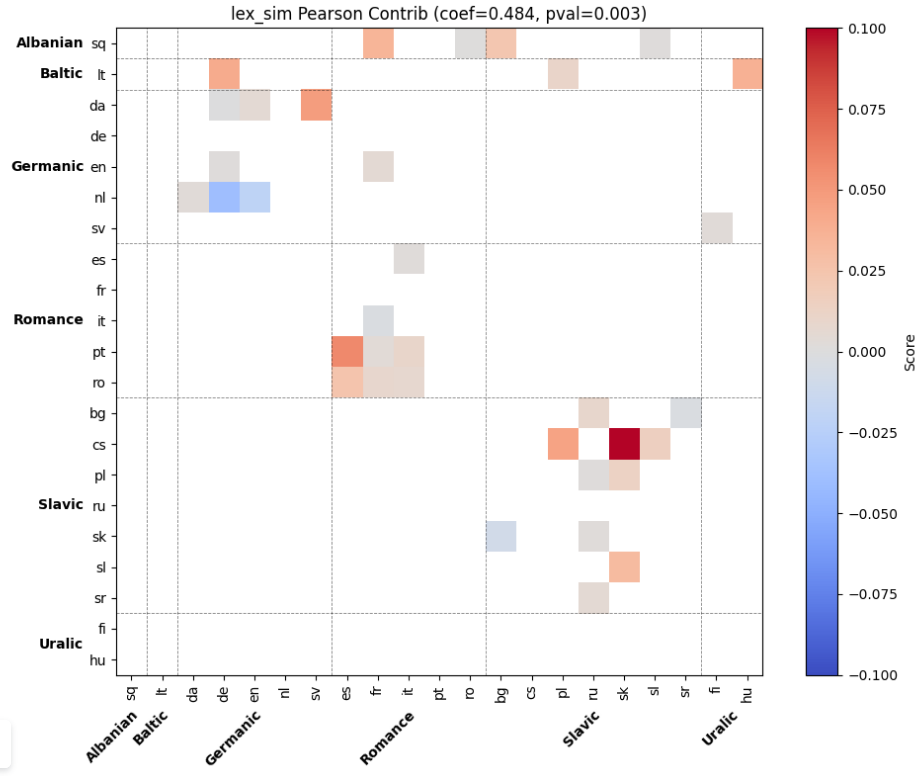

---
<!-- header: Pointwise Pearson Contribution (Spectral KL, Mutual Intelligibility) -->

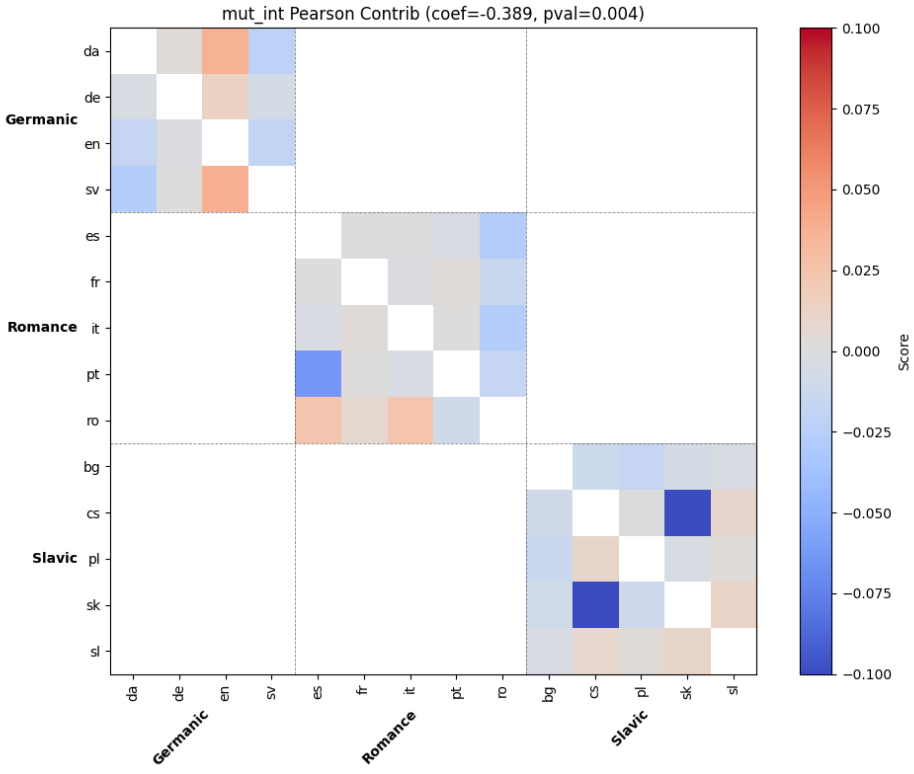

---
<!-- header: Pointwise Pearson Contribution (Spectral KL, Phonemic) -->

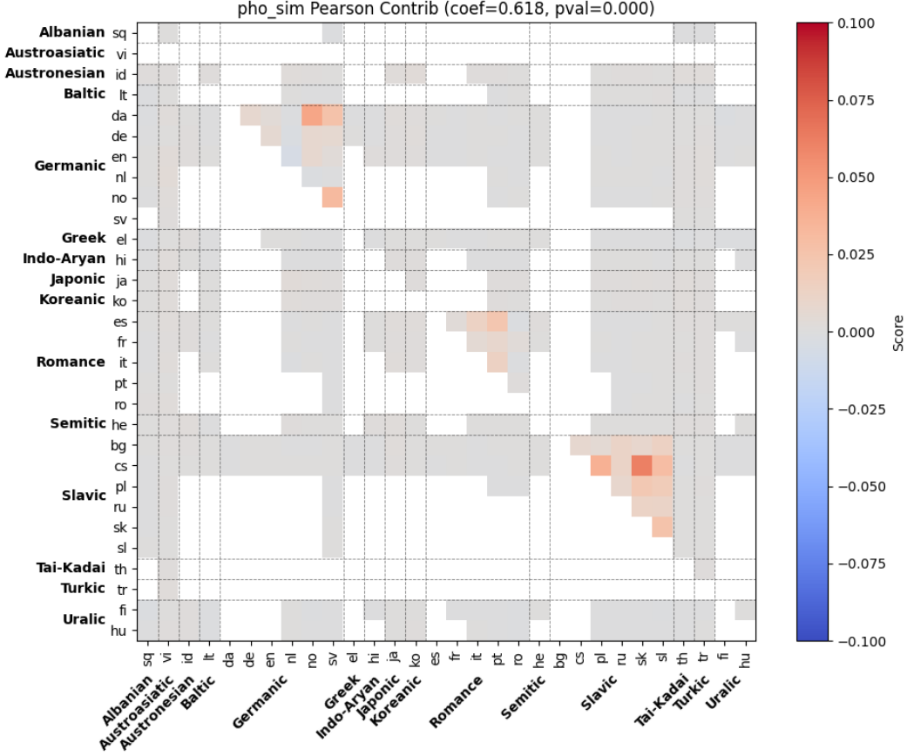

---
<!-- header: Wikisize Investigation (Spectral KL) -->

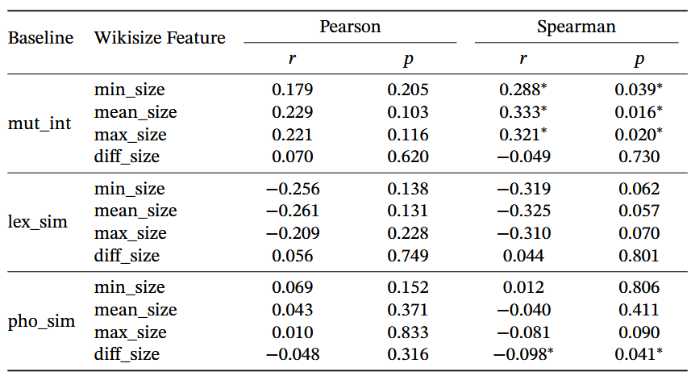

---
<!-- header: 'Table of contents' -->
Motivation
Related Work
Research questions & contributions  
Background 
Methodology   
Experiments  
Results  
**Limitations**  
Future work

---
<!-- header: 'Advantages' -->
- **No linguistic annotation required.**  
  Operates on raw text plus a pre-trained multilingual model, bypassing costly typological coding, phonemic transcription, or crowdsourced intelligibility tests.

- **Captures multi-level structure.**  
  Transformer embeddings bake in phonological, morphological, and syntactic cues, so the resulting spectra integrate evidence across linguistic subsystems rather than targeting a single facet.

- **Inter-model portability.**  
  Comparable results with mBERT and XLM-R suggest the metric is not tied to any specific vocabulary or training regime, making it future-proof as larger multilingual models appear.

---
<!-- header: 'Drawbacks' -->

- **Interpretability.**  
  While frequency bands may be linked *post hoc* to linguistic phenomena, the mapping is indirect; a spike at \(60\,\%\) of Nyquist is harder to interpret than “40 % cognate overlap.’’

- **Dependence on subword tokenization.**  
  BPE / SentencePiece units blur morpheme boundaries, potentially smearing high-frequency cues such as inflectional affixes or clitics.

- **Asymmetry limits.**  
  KL divergence encodes only mild directionality, while overlap and coherence are symmetric. Future work needs metrics whose asymmetry more closely mirrors the sharply asymmetric nature of mutual intelligibility.

---
<!-- header: 'Methodological Limitations' -->

The study covers 100 languages, only a fraction of the 7,000+ attested worldwide. Baseline measures are likewise sparse:

- Mutual-intelligibility data exist mainly for closely related languages; the dataset spans just three Indo-European subfamilies.  
- The FSI scale is English-centric, rating only distances from English.  
- The lexical baseline supports only a subset of language pairs.

Corpus coverage is uneven:  
- **Bible** offers 100 languages but a single (often archaic) genre.  
- **XNLI** spans just 15 languages, 14 of which are machine-translated from English, though it is at least multi-genre.

---
<!-- header: 'Table of contents' -->
Motivation
Related Work
Research questions & contributions  
Background 
Methodology   
Experiments  
Results  
Limitations  
**Future work**

---
<!-- header: 'Future Work' -->
* Add syntactic baseline  
* Compare time-domain cross-correlation  
* Test more genres & dialect continua  
* Try **cepstral** analysis for harmonic structures  
* test on dialect corpora

---
<!-- header: 'Appendix' -->

---
<!-- header: E3: Metric Robustness to Dataset (Likelihood, XLMR) -->

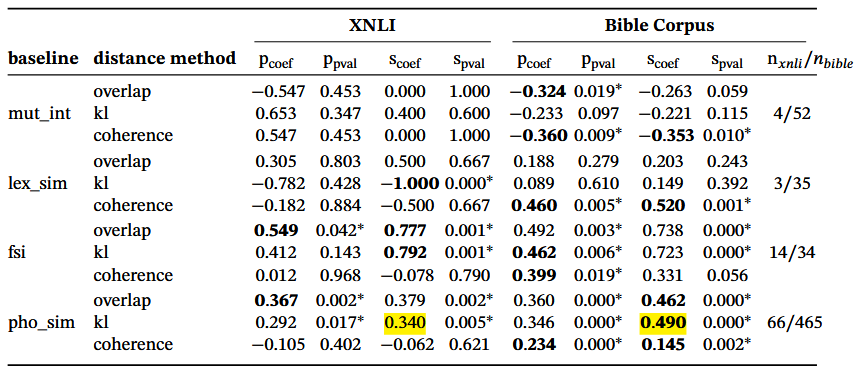

Likelihood spectral metric correlations on the XNLI and Bible corpora. Cells are highlighted when the two coefficients differ by more than 0.10; within those pairs, the larger significant coefficient is additionally shown in bold. *p < 0.05.

---
<!-- header: E3: Metric Robustness to Dataset (Embedding, XLMR) -->

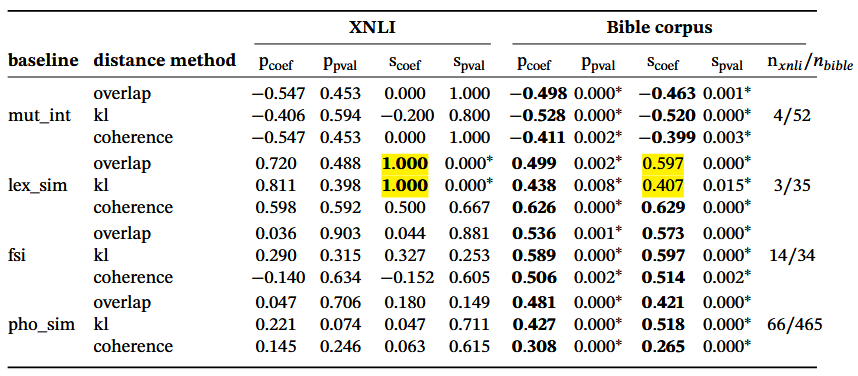

Embedding spectral metric correlations on the XNLI and Bible corpora. 
Cells are highlighted when the two coefficients differ by more than 0.10; within those pairs, the larger significant coefficient is additionally shown in bold. *p < 0.05.

---
<!-- header: E5: mBERT Layer Investigation (Spectral Overlap) -->

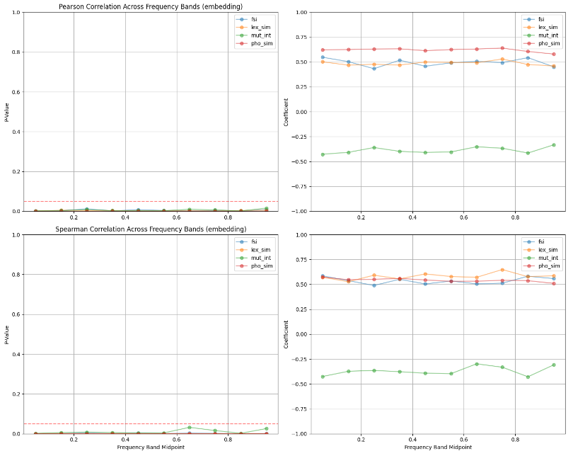

---
<!-- header: E5: mBERT Layer Investigation (Spectral KL) -->

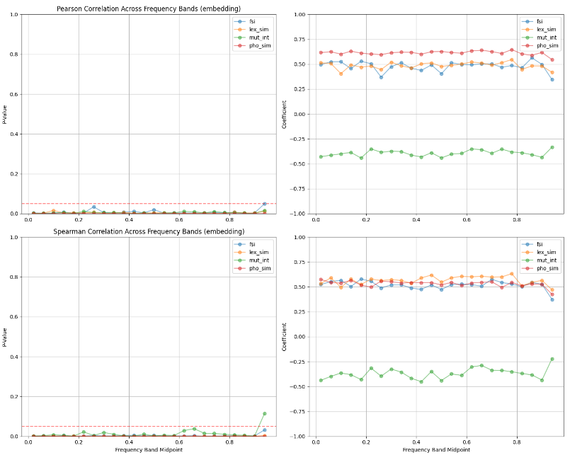

---
<!-- header: E6: Typological Modulation Effects (3A, Consonant-Vowel Ratio)-->

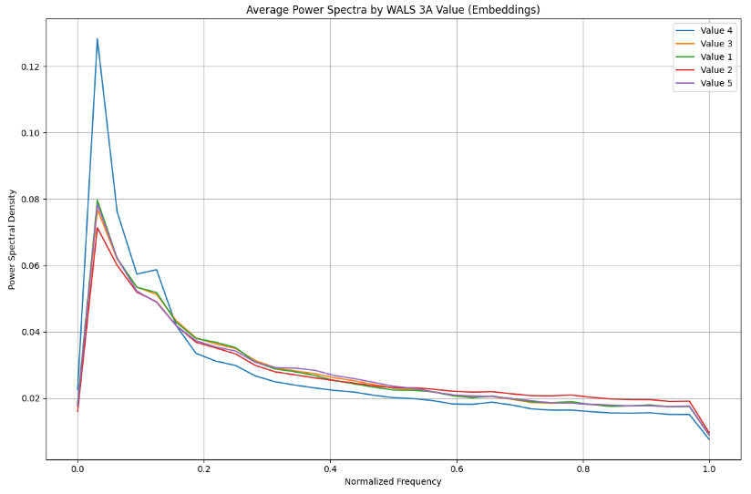

---
<!-- header: E6: Typological Modulation Effects (12A, Syllable Structure)-->

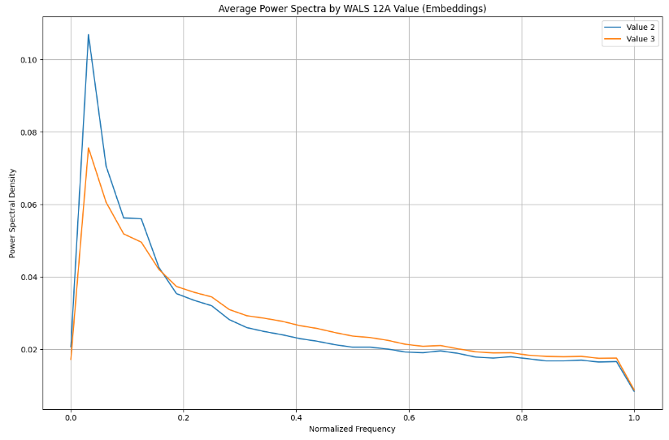

---
<!-- header: E6: Typological Modulation Effects (17A, Rhythm Types)-->

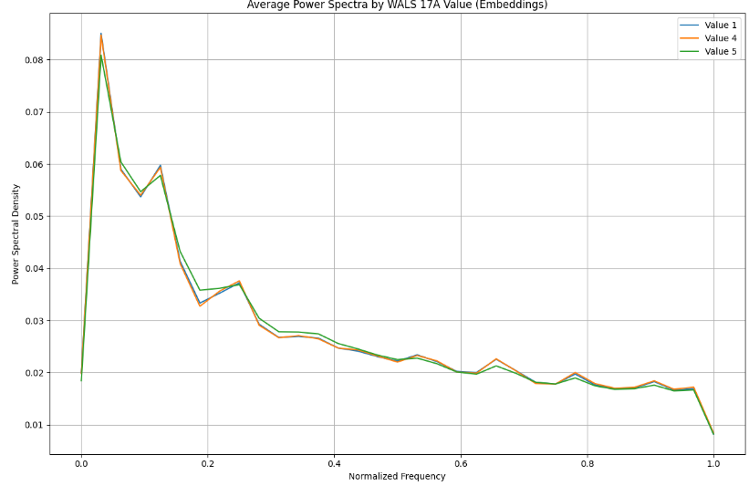

---
<!-- header: E6: Typological Modulation Effects (27A, Reduplication)-->

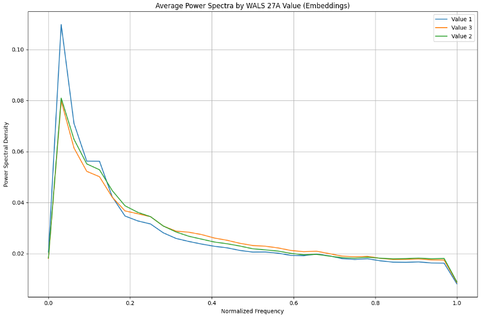

Value 1: Productive full and partial reduplication 	

---
<!-- header: E6: Typological Modulation Effects (34A, Occurrence of Nominal Plurality)-->

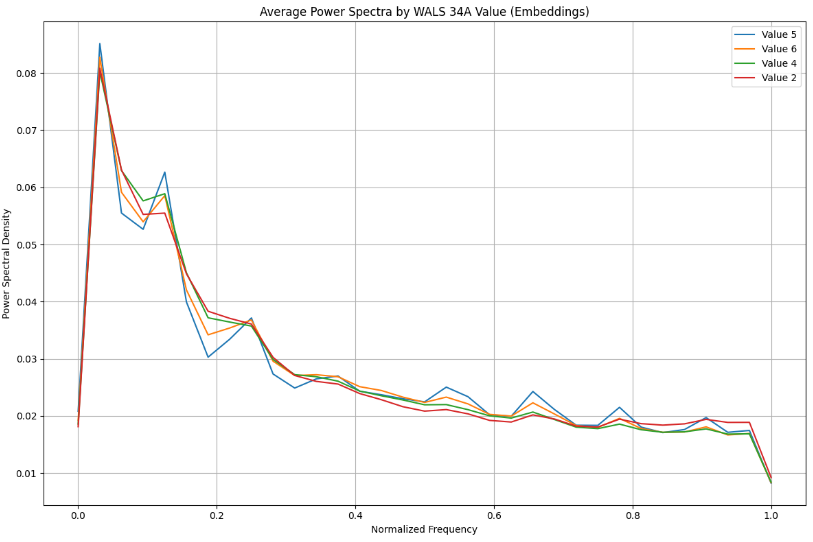

---
<!-- header: E6: Typological Modulation Effects (61A, Adjectives without Nouns)-->

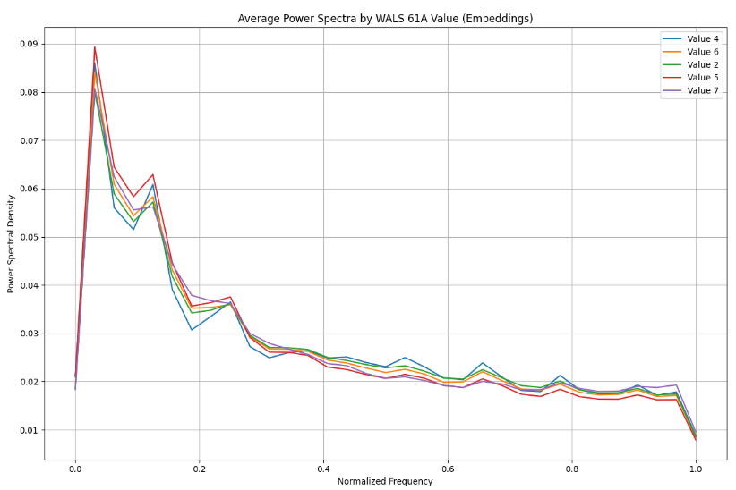

---
<!-- header: E6: Typological Modulation Effects (64A, Nominal and Verbal Conjunction)-->

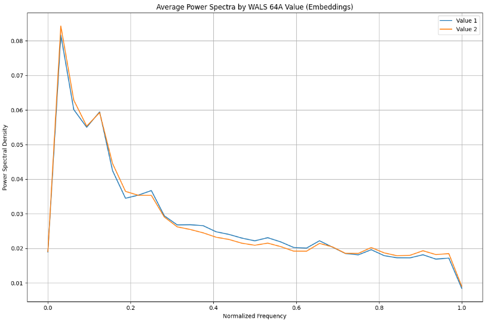

---
<!-- header: E6: Typological Modulation Effects (78A, Coding of Evidentiality)-->

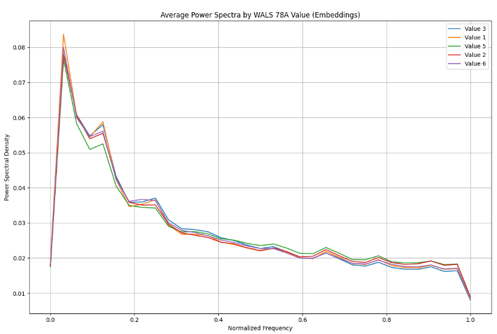