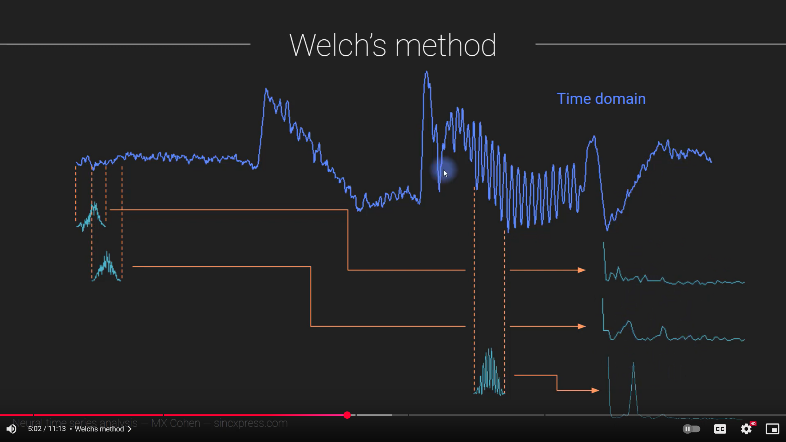
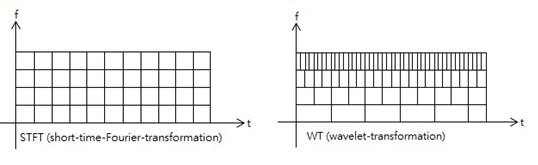
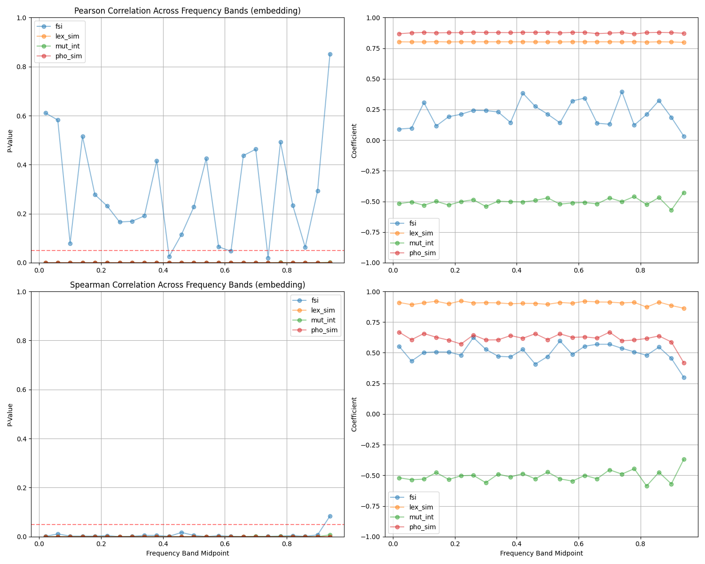
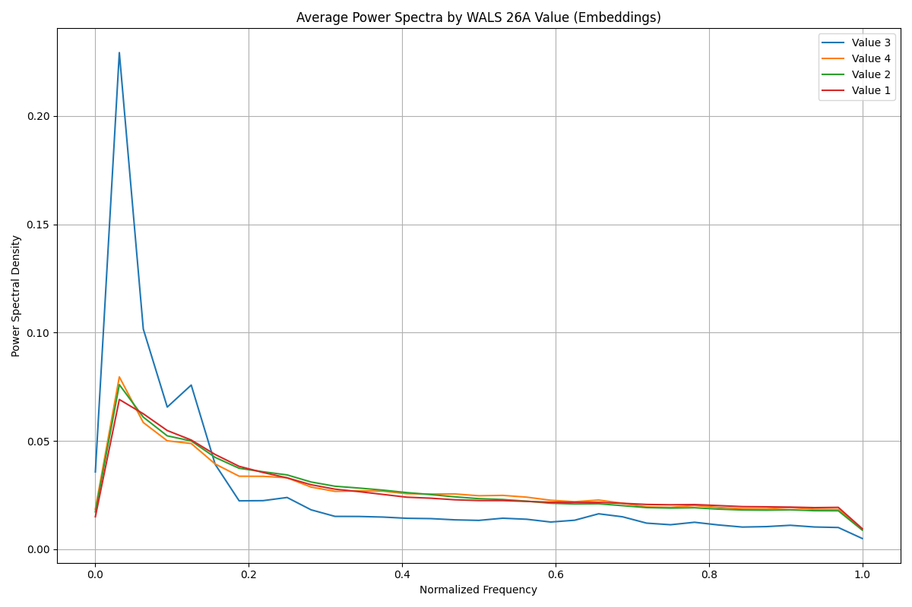
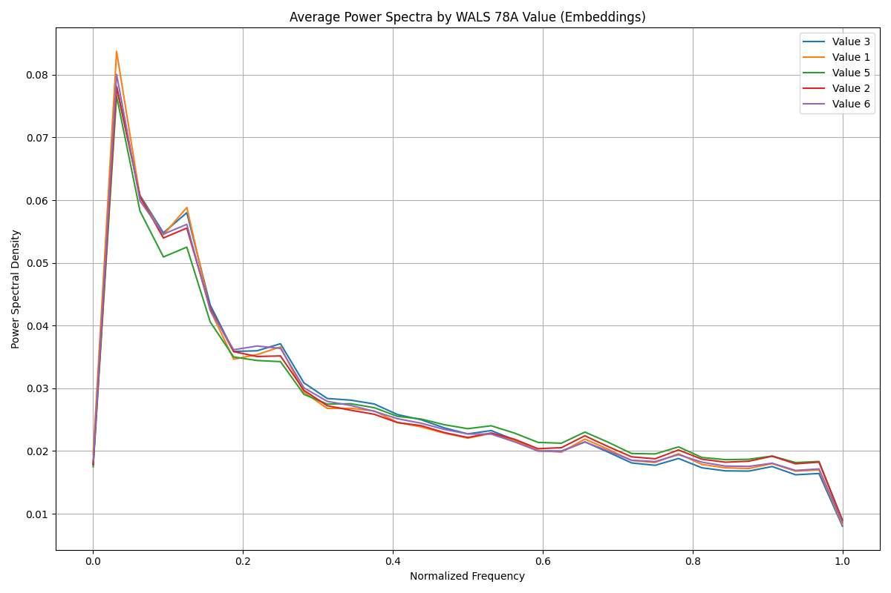

# Linguistic Distance
#### Thom Lazor
#### Mentor: Jan Šnajder
#### University of Zagreb – FER
#### May 2025
---

## Introduction & Motivation

- Languages differ intuitively (e.g., English vs Croatian vs Ukrainian)
- Practical importance:
  - Language learning difficulty
  - Multilingual NLP performance
  - Policy in multilingual societies
---

## Linguistic Subsystems

- **Phonetics**: speech sounds
- **Phonology**: sound systems and rules
- **Morphology**: word structure and inflection
- **Syntax**: sentence structure and order
- **Semantics**: meaning representation
---

## Asymmetry in Distance

- True distances: symmetric, obey triangle inequality
- Linguistic distances often asymmetric:
  - Mutual intelligibility (e.g., Dutch → English ≠ English → Dutch)
  - Divergence-based metrics (e.g., KL Divergence)
---

## Measuring Linguistic Distance

- **Lexical distance** (cognates, edit distance)
- **Phonemic distance** (phoneme inventories, phonemic edit distance)
- **Language acquisition** difficulty
- **Mutual intelligibility** (cloze tests, surveys)
- **Model-based divergence** (e.g., KL of ngram models)
---

## Spectral Analysis

- Decomposes signals into frequencies
- Can reveal hidden patterns and structures
- Common in physics, engineering, music

---

## Spectral Analysis of Speech

- Tools:
  - Welch’s Method for Power Spectral Density (PSD)
  - Short-Time Fourier Transform (STFT)
  - Wavelet Transform
- Applications:
  - Language/dialect identification
  - Accent and prosody analysis
  - text to speech/speech to text
---

### Welch's Method

---

### Short Time Fourier Transform and Wavelet Transform

---

## Key Datasets and Resources

- **World Atlas of Language Structures (WALS)**: 2,662 languages, 192 features
- **Automated Similarity Judgment Program (ASJP)**: 7,726 languages, normalized Levenshtein distance
- **Cross-Lingual NLI Corpus (XNLI)**: 15-language inference corpus
- **Bible-Corpus**: Aligned texts in 100 languages
- **mBERT / XLM-R**: Multilingual transformer models
---

### Frequency Banding 

---

#### 26A: [Prefixing vs. Suffixing in Inflectional Morphology](https://wals.info/chapter/26)
Includes many kinds of affixing, like case affixes on nouns
Croatian (Strongly suffixing, Postpositional clitics): Dobar [sam]
- value 1 (Little or no inflectional morphology): ['th', 'vi']
- value 2 (Predominantly suffixing): ['bg', 'de', 'en', 'es', 'fi', 'hi', 'hu', 'id', 'it', 'ja', 'ko', 'lt', 'ne', 'no', 'pl', 'pt', 'ru', 'sv', 'tr']
- value 3 (Moderate preference for suffixing): ['am', 'he']
- value 4 (Approximately equal amounts of suffixing and prefixing): ['ar']

---

#### WALS 26A: [Prefixing vs. Suffixing in Inflectional Morphology](https://wals.info/chapter/26)

---
### 78A: [Coding of Evidentiality](https://wals.info/chapter/78)

- marks the source of information the speaker has for his or her statement
- German (modal morpheme): Er soll krank sein/He is reportedly sick
sollen is a modal verb meaning reportedly

value 1 (No grammatical evidentials): ['en', 'es', 'he', 'hi', 'hu', 'id', 'ru', 'th', 'vi']
value 2 (Verbal affix or clitic) 	: ['ja', 'ko', 'lt', 'ne']
value 3 (Part of the tense system): ['bg', 'tr']
value 5 (Modal morpheme): ['fi']
value 6 (Mixed systems): ['sv']

---

#### WALS 78A: [Coding of Evidentiality](https://wals.info/chapter/78)

---

## Conclusion

- Linguistic distance = multi-dimensional and messy
- Used in language education, NLP, typology, policy
- Spectral methods may offer objective, interpretable analysis
